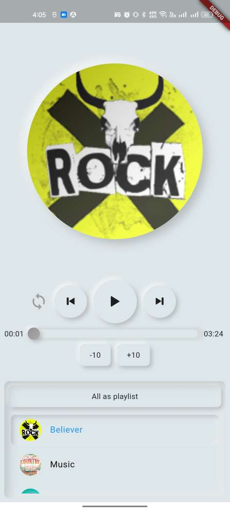
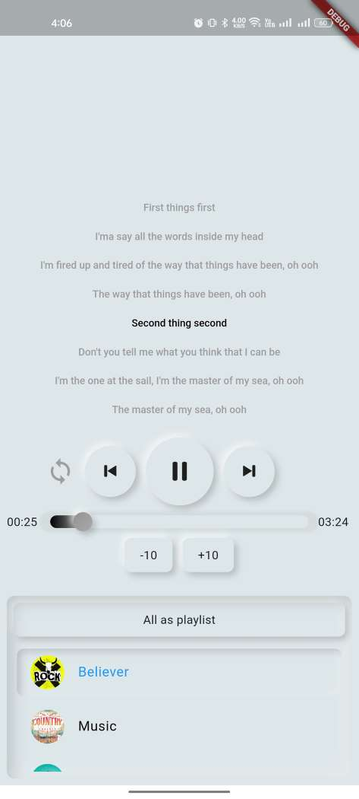
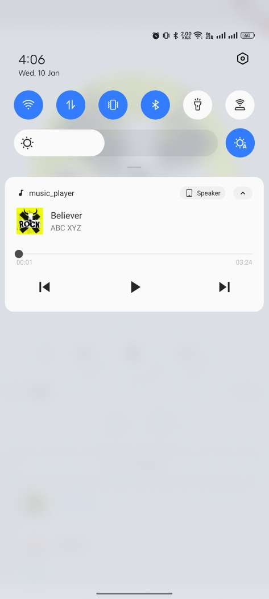

# Music Player with Lyrics by BrightForce Technology.

A Flutter music player application with synchronized lyrics and neumorphic UI effects.

## Features

- Play a single song or all songs in the playlist.
- Neumorphic design for an elegant user interface.
- Synchronized lyrics display.
- Play, pause, next, and previous song functionalities.
- Seek audio with drag gesture.
- Repeat and shuffle options.
- +10 seconds and -10 seconds seek options.

## Screenshots

## Getting Started

### Prerequisites

- Flutter 3.16.5
- [assets_audio_player](https://pub.dev/packages/assets_audio_player) package
- [flutter_neumorphic](https://pub.dev/packages/flutter_neumorphic) package

1. **Navigate to the project folder**

2. **Install dependencies:**
   flutter pub get

3. **Run the application:**
- For Android:
  - flutter run 

- For iOS: 
  - Navigate to the iOS folder: cd ios
  - Install Pods: pod install
  - Return to the Project Root: cd ..
  - Run the iOS Application: flutter run -d ios

### These steps assume that you have CocoaPods installed on your machine. If you don't have it installed, you can install it using:
- sudo gem install cocoapods